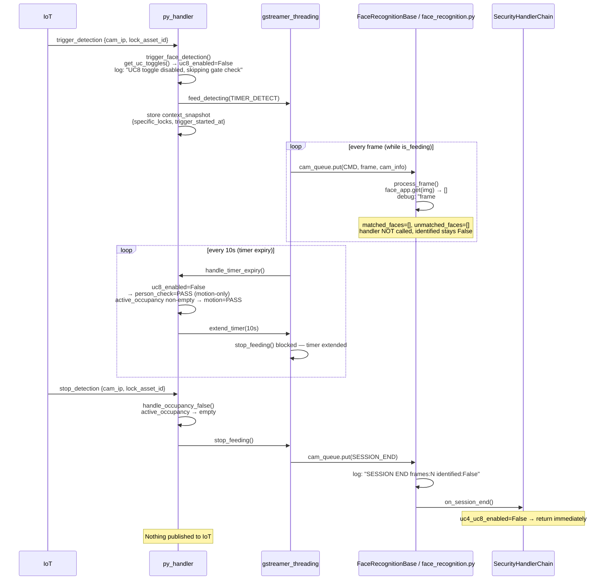
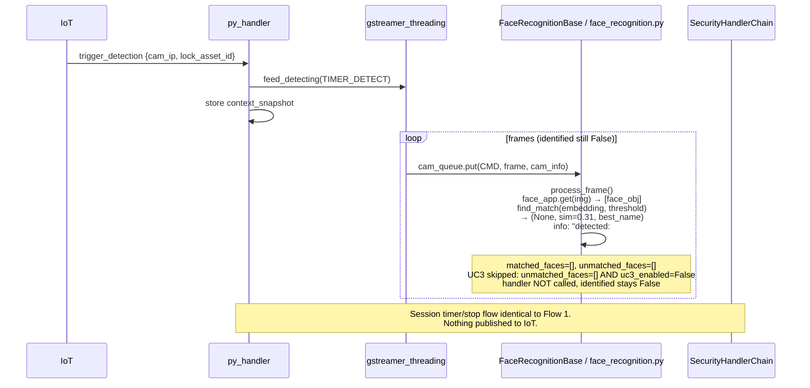
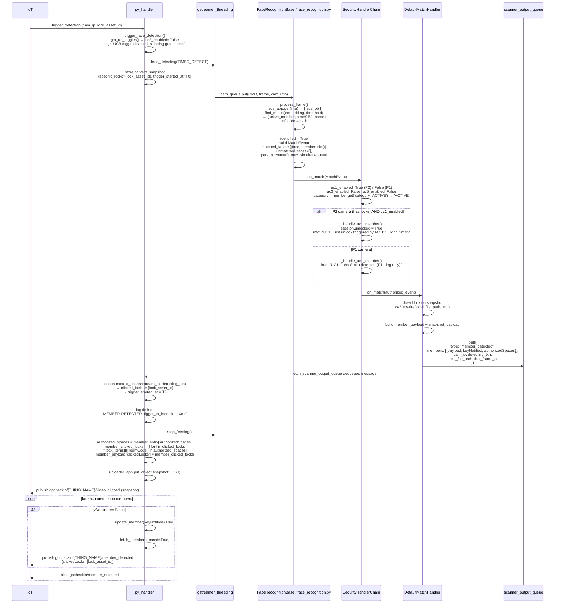

# InsightFace Backend — Execution Flows

## Context

When `FACE_BACKEND == 'insightface'`, only **UC1 (Member Identification)** is active.
UC3 (Unknown Face), UC4 (Group Size), UC5 (Non-Active Member), and UC8 (Body Detection)
all require Hailo hardware and are disabled by `get_uc_toggles()`.

The gate check and timer-expiry person check are skipped (no `gate_check` / `get_extend_check`
on InsightFace's `FaceAnalysisChild`). Timer extension is **motion-only**: the session extends
as long as `active_occupancy` is non-empty (i.e. a `stop_detection` event has not arrived).

---

## Flow 1 — No Face Detected

---

## Flow 2 — Face Detected, No Match

---

## Flow 3 — Face Detected and Recognized

